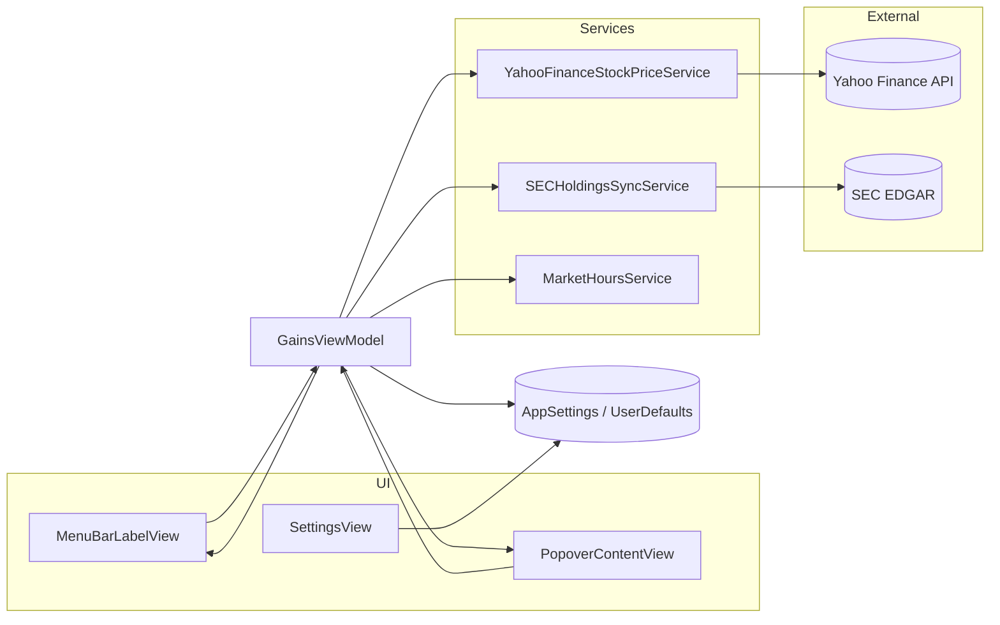

# Architecture

Muskometer is a native macOS **menu bar utility** built with SwiftUI (`MenuBarExtra`) and a thin **MVVM** layer. All network I/O is async; the view model owns refresh timing and state.

## Pattern: MVVM

| Layer | Role |
|-------|------|
| **Views** | `MenuBarLabelView`, `PopoverContentView`, `SettingsView` — render snapshot, forward user actions |
| **ViewModel** | `GainsViewModel` — refresh loop, holdings sync, formatted menu bar title |
| **Models** | `StockQuote`, `GainsSnapshot`, `PortfolioHolding`, `MenuBarDisplayMode` |
| **Services** | Yahoo quotes, SEC Form 4 sync, US market hours |
| **Utilities** | `AppSettings` (UserDefaults), formatters, `SPCXHoldings` defaults |

`GainsViewModel` is `@Observable` and `@MainActor`. Services conform to small protocols (`StockPriceServiceProtocol`, `HoldingsSyncServiceProtocol`, `MarketHoursServiceProtocol`) for test injection.

## Key files

| File | Purpose |
|------|---------|
| `App/MuskometerApp.swift` | `MenuBarExtra`, commands, settings window |
| `ViewModels/GainsViewModel.swift` | Core state machine + refresh loop |
| `Services/YahooFinanceStockPriceService.swift` | Chart API → `StockQuote` |
| `Services/SECHoldingsSyncService.swift` | EDGAR Form 4 → TSLA/SPCX share counts |
| `Services/MarketHoursService.swift` | RTH-only sessions (9:30–16:00 ET), weekends, US market holidays + early closes |
| `Utilities/SPCXHoldings.swift` | Default SPCX share count + legacy migration |
| `Utilities/AppSettings.swift` | Holdings, refresh interval, launch at login |

## Paper gain math

```
paperGain = shareCount × (currentPrice − previousClose)
```

- **TSLA** — share count from SEC Form 4 (direct beneficial-ownership row).
- **SPCX** — share counts aggregate Class A/B trust lines plus restricted shares from SEC Form 4 filing remarks (~6B Class A-equivalent).
- **Quotes** — TSLA and SPCX use identical Yahoo fetch, session, and price-selection logic. See [HOLDINGS.md](HOLDINGS.md).

Combined gain is the sum across holdings. Menu bar display mode (dollars vs percent, combined vs split) is a view-layer concern over the same snapshot.

## Data flow



## Refresh loop

1. **Start** (`MenuBarLabelView.onAppear` → `viewModel.start()`). `PopoverContentView.onAppear` only toggles popover visibility for settings routing.
2. **SEC sync** if `AppSettings.needsHoldingsSync` (default: once per 24h).
3. **First refresh** runs immediately on start (quotes for all holding symbols in parallel → `GainsSnapshot`).
4. Loop until `stop()` on app terminate, using `openSessionRefreshTiming(isQuotable:wasQuotable:)`:
   - **Quotable (regular session only, 9:30–16:00 ET / early close):** after the first refresh of a session, sleep the user interval (60–120s from Settings), then refresh.
   - **Off hours** (including pre/post): sleep until next regular open (`max(timeUntilOpen, 60)`; fallback 300s if no next open), set `wasQuotable = false`, then on the next quotable tick **refresh immediately** (no extra pre-sleep).
5. Subsequent open-session cycles sleep the user interval, then refresh again.

Force refresh (`⌘R`) bypasses the in-flight guard and increments a generation token to drop stale responses.

## Market holidays

`MarketHoursService` treats US equity market holidays as a **hardcoded date set** in `MarketHoursService.swift` covering **2026 and 2027** only (NYSE-style calendar: New Year's Day, MLK Day, Presidents' Day, Good Friday, Memorial Day, Juneteenth, Independence Day observed, Labor Day, Thanksgiving, Christmas).

### Early closes

The same service keeps a small **early-close map** (date → regular-session end as minutes since midnight ET) for 2026–2027. Typical close is **13:00 ET** (1:00 PM):

| Date | Reason |
|------|--------|
| 2026-11-27 | Day after Thanksgiving |
| 2026-12-24 | Christmas Eve |
| 2027-11-26 | Day after Thanksgiving |

On early-close days, regular session ends at the early hour (not 16:00); everything after is **closed** (RTH-only — no post-market refresh). Daily records finalize at regular close (or early close). Without this map, afternoon hours on early-close days would be treated as regular session (wrong refresh cadence).

This is intentional for v0.1.0 — no external holiday API. **Maintainers must extend holidays and early closes annually** (or replace them with a maintained data source) so refresh timing and "market open" status stay correct after 2027.

## Sandbox & storage

- **Sandboxed builds** (Xcode Debug/Release product, optional signed Developer ID via `scripts/release.sh`): App Sandbox + `network.client` only (`Muskometer/Muskometer.entitlements`).
- **Unsigned package-dmg path** (`scripts/package-dmg.sh`, current public GitHub Release artifacts): built with `CODE_SIGNING_ALLOWED=NO` — **no embedded entitlements**, so **not sandboxed**. Open-source distribution without a paid Apple account; Gatekeeper requires right-click → Open. See [SECURITY.md](../SECURITY.md) and [RELEASE.md](RELEASE.md).
- Holdings, refresh interval, display mode, launch-at-login → **UserDefaults**.
- No local database, no analytics SDK, no API keys.

## Testing strategy

`MuskometerTests` covers pure logic (formatters, SPCX scaling, market hours, Form 4 parser) and view model behavior with mock services. `scripts/verify.sh` adds integration checks against live Yahoo endpoints.

---

© [Jordan Golson](https://jordangolson.com) · [info@muskometer.org](mailto:info@muskometer.org)