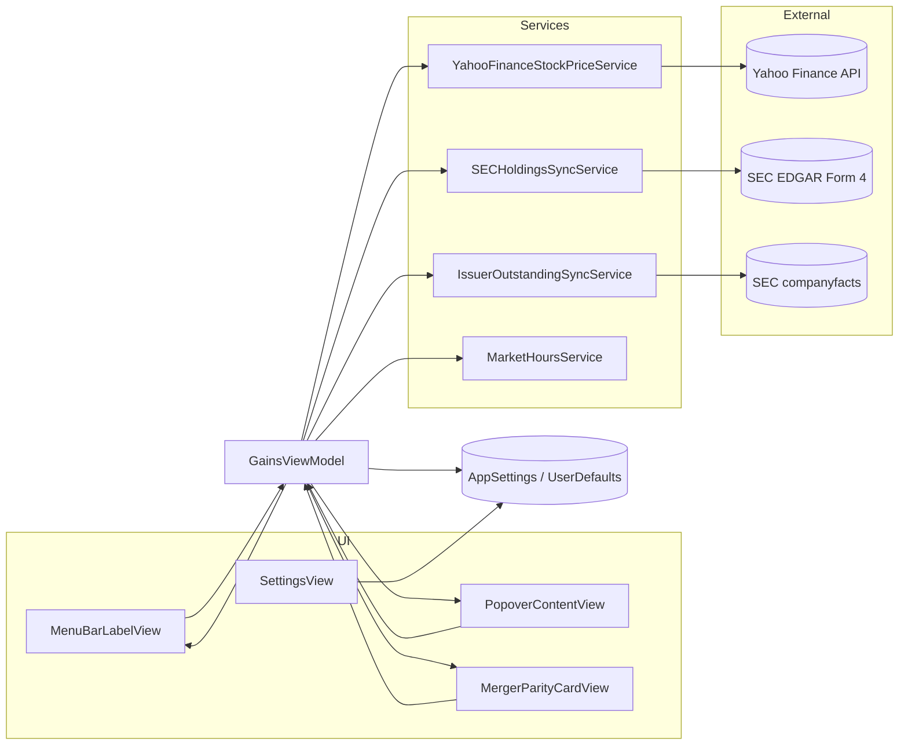

# Architecture

Muskometer is a native macOS **menu bar utility** built with SwiftUI (`MenuBarExtra`) and a thin **MVVM** layer. All network I/O is async; the view model owns refresh timing and state.

## Pattern: MVVM

| Layer | Role |
|-------|------|
| **Views** | `MenuBarLabelView`, `PopoverContentView`, `SettingsView`, `MergerParityCardView` — render snapshot, forward user actions |
| **ViewModel** | `GainsViewModel` — refresh loop, Form 4 + issuer-outstanding sync, formatted menu bar title, parity presentation |
| **Models** | `StockQuote`, `GainsSnapshot`, `PortfolioHolding`, `MenuBarDisplayMode` |
| **Services** | Yahoo quotes, SEC Form 4 sync, issuer companyfacts outstanding, US market hours |
| **Utilities** | `AppSettings` (UserDefaults), formatters, `SPCXHoldings` / `IssuerSharesOutstanding` defaults, `MergerMarketCapParity` |

`GainsViewModel` is `@Observable` and `@MainActor`. Services conform to small protocols (`StockPriceServiceProtocol`, `HoldingsSyncServiceProtocol`, `MarketHoursServiceProtocol`) for test injection.

## Key files

| File | Purpose |
|------|---------|
| `App/MuskometerApp.swift` | `MenuBarExtra`, commands, settings window |
| `ViewModels/GainsViewModel.swift` | Core state machine + refresh loop + parity presentation |
| `Services/YahooFinanceStockPriceService.swift` | Chart API → `StockQuote` |
| `Services/SECHoldingsSyncService.swift` | EDGAR Form 4 → TSLA/SPCX **ownership** share counts |
| `Services/IssuerOutstandingSyncService.swift` | SEC companyfacts → issuer shares outstanding (best-effort) |
| `Services/CompanyFactsOutstandingResolver.swift` | Pure companyfacts JSON → point-in-time outstanding (rejects WASO) |
| `Services/MarketHoursService.swift` | RTH-only sessions (9:30–16:00 ET), weekends, US market holidays + early closes |
| `Utilities/MergerMarketCapParity.swift` | Pure implied-TSLA calculator for market-cap parity card |
| `Utilities/IssuerSharesOutstanding.swift` | Bundled cover/companyfacts defaults for outstanding |
| `Utilities/SPCXHoldings.swift` | Default SPCX ownership share count + legacy migration |
| `Utilities/AppSettings.swift` | Ownership, outstanding, refresh interval, parity card toggle, launch at login |
| `Views/MergerParityCardView.swift` | Main-popover “If Tesla had SpaceX's market cap” card |

## Paper gain math

```
paperGain = shareCount × (currentPrice − previousClose)
```

- **TSLA** — direct common-stock ownership reconstructed from a verified Form 4 anchor and later dated observations.
- **SPCX** — sellable ownership reconstructed by security class, direct/indirect ownership, ownership nature, and option grant identity. Unchanged Class A/B, trust, preferred, and option buckets survive a partial-bucket filing; unvested performance RSUs in remarks are excluded (5,116,475,230 default).
- **Quotes** — TSLA and SPCX use identical Yahoo fetch, session, and price-selection logic. See [HOLDINGS.md](HOLDINGS.md).

Combined gain is the sum across holdings. Menu bar display mode (dollars vs percent, combined vs split) is a view-layer concern over the same snapshot. The popover no longer shows comparison captions (the “today’s loss equals / today’s gain could…” block and its selector/history path were removed).

### Market-cap parity (orthogonal)

Issuer **shares outstanding** (company totals) are separate from Form 4 ownership. On the same ~24h SEC cadence, a best-effort companyfacts fetch updates `sharesOutstanding_*` without participating in Form 4 completeness. The pure calculator:

```
implied TSLA $/share = (SPCX Class A price × SPCX A+B outstanding) / TSLA outstanding
```

Presentation is gated by the Settings toggle `showMergerParityCard` (default on). See [HOLDINGS.md](HOLDINGS.md).

## Data flow


```mermaid
flowchart LR
    subgraph UI
        MB[MenuBarLabelView]
        POP[PopoverContentView]
        SET[SettingsView]
        MPC[MergerParityCardView]
    end

    VM[GainsViewModel]

    subgraph Services
        YF[YahooFinanceStockPriceService]
        SEC[SECHoldingsSyncService]
        OUT[IssuerOutstandingSyncService]
        MH[MarketHoursService]
    end

    subgraph External
        Yahoo[(Yahoo Finance API)]
        EDGAR[(SEC EDGAR Form 4)]
        CF[(SEC companyfacts)]
    end

    AS[(AppSettings / UserDefaults)]

    MB --> VM
    POP --> VM
    MPC --> VM
    SET --> AS
    VM --> AS

    VM --> YF
    VM --> SEC
    VM --> OUT
    VM --> MH

    YF --> Yahoo
    SEC --> EDGAR
    OUT --> CF

    VM --> MB
    VM --> POP
    VM --> MPC
```

## Ownership reconciliation

Every Form 4 sync starts from the immutable TSLA/SPCX anchors described in [HOLDINGS.md](HOLDINGS.md). It scans through both anchors, validates their observed rows, and applies absolute balances by effective date. Filing order does not override transaction chronology. Document order resolves same-day transactions within one ordinary filing; an amendment must identify a unique original bucket/date. A malformed or ambiguous relevant observation, unknown bucket, or missing anchor coverage omits the affected symbol. AppSettings applies ownership only when the existing all-symbol completeness check succeeds.

A sync has budgets of 100 unique Form 4/4A accessions, 10 unique submission archive pages, 100 archive descriptors, and 10,000 relevant observations. At most 211 HTTP requests can be issued (one recent-submissions request, ten archives, two requests per accession), paced at least 120ms apart with cancellation checks. Reconstruction state lasts one sync; current balances are limited to the known anchor buckets.

Companyfacts retains accession/form metadata and selects the latest eligible preferred period/filing group. Equal repeated whole-entity totals count once; conflicting totals remain unresolved, including conflicts in DEI that cannot fall back to older GAAP. Weighted-average shares remain excluded. Outstanding and ownership storage/provenance stay independent.

## Refresh and notification lifecycle

1. `start()` schedules initial quotes immediately using current settings and begins one independent current-lifecycle SEC synchronization. SEC still follows the daily success/attempt backoff; a slow SEC endpoint cannot delay quotes or the trading clock.
2. During regular hours, a separate timer sleeps the settings interval, capped at the time remaining to close. A complete accepted ownership change requests at most one additional quote refresh; unchanged counts do not refetch. Quote acceptance uses current holdings and rejects superseded generations or lifecycles.
3. Accepted snapshots synchronously commit records, chart samples, milestone state, and all threshold observations before notification delivery can suspend. The chart retains its 400-sample cap. Gain delivery uses `observeUpdate` and background workers; returning from `refresh()` does **not** mean gain notifications have finished. The compatible `processUpdate(...) async` API remains available for direct callers that await delivery.
4. For each person/preset, the polling notification path keeps one physical delivery worker and one replaceable latest pending claim. Crossing/lifecycle identities protect rearm, retry, reset, disabling, and day rollover from stale completions. A failed current crossing retries on a later accepted above-threshold observation; it does not spin. Canceled workers retain their slot until the transport actually returns.
5. The trading clock advances independently of quote success. At regular or early close, a real unfinished session finalizes from its last observed regular sample. Failed/partial quotes preserve the quote timestamp, mark existing data stale, and update the session/next-open labels without synthetic samples. Day-close text includes the last observation time.
6. Leaving an observed regular session creates one closing quote obligation and permits one extra recovery attempt after a 30-second recovery interval. If physical quote capacity is full, that one obligation waits for capacity; success does not add a retry. Stop or the next regular open supersedes it. Overnight the timer sleeps until the next regular open (minimum 0.5s; 300s fallback if unavailable), then refreshes promptly. There is no continuous overnight quote or notification retry loop.
7. Day-close work remains durable while delivery is in flight or fails. Only delivery confirmation, an already-confirmed day, or an intentional disabled-feature skip acknowledges the exact pending value. Explicit `refresh()` awaits the admitted day-close attempt it starts; scheduled quotes do not wait for it. Pending work can retry on later refresh/start/clock opportunities.

Per view model, quote, SEC synchronization, and summary work each have **two physical task slots**: one current request and room for a superseded transport. Only one SEC synchronization belongs to the current lifecycle. Stop/reset cancel owned tasks and invalidate results, but cancellation-unaware transports keep their slots until completion; repeated restart cannot create unbounded requests. Force refresh bypasses logical loading, not physical capacity. Weak view-model captures allow stopped models to deallocate while slow boundary services finish.

## Popover and login state

The main popover stays 360 points wide and uses available screen height minus 32 points, capped at 900. Header/footer actions surround a scrolling content region. Embedded Settings stays within the same constraint (592 points wide, at most 650 high), with scrolling tab content and reachable footer controls. The actual hosted populated view is exercised at heights 600, 700, 800, and 900.

Launch-at-login reconciliation distinguishes not registered, enabled, awaiting approval, and unavailable. A desired item awaiting approval remains registered without another registration attempt; approval can then become enabled. Explicit disable unregisters a pending/enabled item. Errors remain visible, and the older Boolean protocol adapter remains compatible. Tests use mocks without changing system login items.

## Market holidays

`MarketHoursService` treats US equity market holidays as a **hardcoded date set** in `MarketHoursService.swift` covering **2026 through 2028** (NYSE-style calendar: New Year's Day, MLK Day, Presidents' Day, Good Friday, Memorial Day, Juneteenth, Independence Day observed, Labor Day, Thanksgiving, Christmas). January 1, 2028 is a Saturday and has no observed NYSE holiday. Friday, December 31, 2027 is a regular trading day; its next opening after close is Monday, January 3, 2028 at 9:30 AM ET.

### Early closes

The same service keeps a small **early-close map** (date → regular-session end as minutes since midnight ET) for 2026–2028. Typical close is **13:00 ET** (1:00 PM):

| Date | Reason |
|------|--------|
| 2026-11-27 | Day after Thanksgiving |
| 2026-12-24 | Christmas Eve |
| 2027-11-26 | Day after Thanksgiving |
| 2028-07-03 | Day before Independence Day |
| 2028-11-24 | Day after Thanksgiving |

On early-close days, regular session ends at the early hour (not 16:00); everything after is **closed** (RTH-only — no post-market refresh). Daily records finalize at regular close (or early close). Without this map, afternoon hours on early-close days would be treated as regular session (wrong refresh cadence).

This is intentional for v0.1.0 — no external holiday API. **Maintainers must extend holidays and early closes annually** (or replace them with a maintained data source) so refresh timing and "market open" status stay correct after 2028.

## Sandbox & storage

- **Sandboxed builds** (Xcode Debug/Release product, optional signed Developer ID via `scripts/release.sh`): App Sandbox + `network.client` only (`Muskometer/Muskometer.entitlements`).
- **Unsigned package-dmg path** (`scripts/package-dmg.sh`, current public GitHub Release artifacts): built with `CODE_SIGNING_ALLOWED=NO` — **no embedded entitlements**, so **not sandboxed**. Open-source distribution without a paid Apple account; Gatekeeper requires right-click → Open. See [SECURITY.md](../SECURITY.md) and [RELEASE.md](RELEASE.md).
- Ownership counts, issuer outstanding, refresh interval, display mode, parity card toggle, launch-at-login → **UserDefaults**.
- No local database, no analytics SDK, no API keys.

## Testing strategy

`MuskometerTests` separates ownership, notification, interface/calendar, and refresh/lifecycle regressions from shared baseline tests. Controlled transport, notification, login, clock, and sleeper boundaries exercise the actual production code. `scripts/verify.sh` runs typecheck, full XCTest, Release, entitlements, optional live Yahoo math, and marketing checks. See [DEVELOPING.md](DEVELOPING.md) and the [integrated validation record](marshal/plans/2026-09-10-review-fixes/reviews/task-6-validation/README.md) for evidence and limits.

---

© [Jordan Golson](https://jordangolson.com) · [info@muskometer.org](mailto:info@muskometer.org)