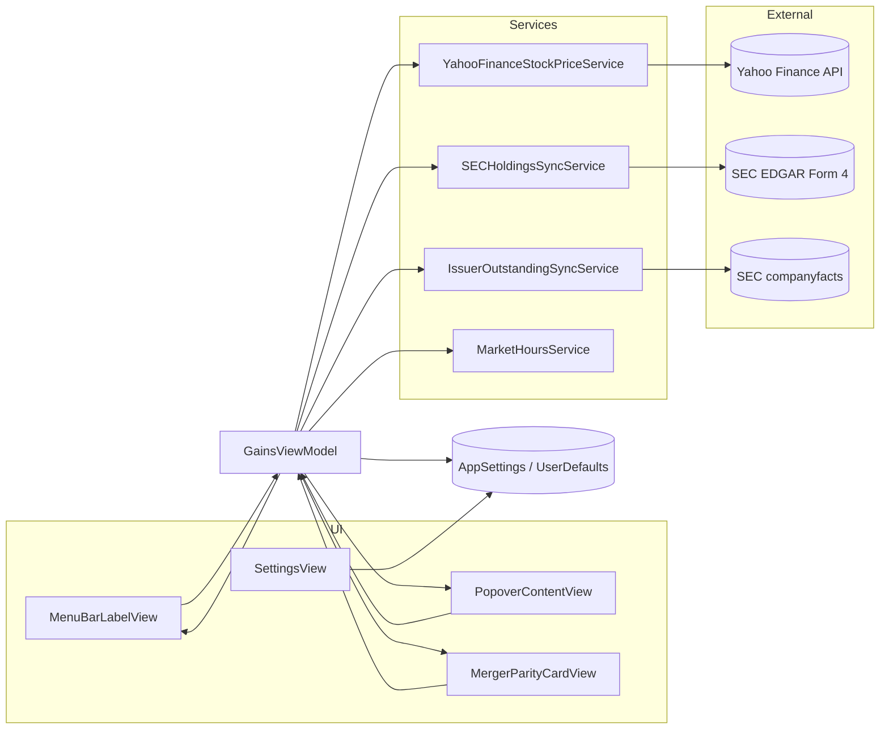

# Architecture

Muskometer is a native macOS **menu bar utility** built with SwiftUI (`MenuBarExtra`) and a thin **MVVM** layer. All network I/O is async; the view model owns refresh timing and state.

## Pattern: MVVM

| Layer | Role |
|-------|------|
| **Views** | `MenuBarLabelView`, `PopoverContentView`, `SettingsView`, `MergerParityCardView` — render snapshot, forward user actions |
| **ViewModel** | `GainsViewModel` — refresh loop, Form 4 + issuer-outstanding sync, formatted menu bar title, parity presentation |
| **Models** | `StockQuote`, `GainsSnapshot`, `PortfolioHolding`, `MenuBarDisplayMode` |
| **Services** | Yahoo quotes, SEC Form 4 sync, issuer companyfacts outstanding, US market hours |
| **Utilities** | `AppSettings` (UserDefaults), formatters, `SPCXHoldings` / `IssuerSharesOutstanding` defaults, `MergerMarketCapParity` |

`GainsViewModel` is `@Observable` and `@MainActor`. Services conform to small protocols (`StockPriceServiceProtocol`, `HoldingsSyncServiceProtocol`, `MarketHoursServiceProtocol`) for test injection.

## Key files

| File | Purpose |
|------|---------|
| `App/MuskometerApp.swift` | `MenuBarExtra`, commands, settings window |
| `ViewModels/GainsViewModel.swift` | Core state machine + refresh loop + parity presentation |
| `Services/YahooFinanceStockPriceService.swift` | Chart API → `StockQuote` |
| `Services/SECHoldingsSyncService.swift` | EDGAR Form 4 → TSLA/SPCX **ownership** share counts |
| `Services/IssuerOutstandingSyncService.swift` | SEC companyfacts → issuer shares outstanding (best-effort) |
| `Services/CompanyFactsOutstandingResolver.swift` | Pure companyfacts JSON → point-in-time outstanding (rejects WASO) |
| `Services/MarketHoursService.swift` | RTH-only sessions (9:30–16:00 ET), weekends, US market holidays + early closes |
| `Utilities/MergerMarketCapParity.swift` | Pure implied-TSLA calculator for market-cap parity card |
| `Utilities/IssuerSharesOutstanding.swift` | Bundled cover/companyfacts defaults for outstanding |
| `Utilities/SPCXHoldings.swift` | Default SPCX ownership share count + legacy migration |
| `Utilities/AppSettings.swift` | Ownership, outstanding, refresh interval, parity card toggle, launch at login |
| `Views/MergerParityCardView.swift` | Main-popover “If Tesla had SpaceX's market cap” card |

## Paper gain math

```
paperGain = shareCount × (currentPrice − previousClose)
```

- **TSLA** — ownership from SEC Form 4 (last direct common-stock post-transaction amount).
- **SPCX** — sellable ownership: last-row-wins Class A+B tables plus vested option underlying shares; unvested performance RSUs in remarks are excluded (~5.116B Class A-equivalent default).
- **Quotes** — TSLA and SPCX use identical Yahoo fetch, session, and price-selection logic. See [HOLDINGS.md](HOLDINGS.md).

Combined gain is the sum across holdings. Menu bar display mode (dollars vs percent, combined vs split) is a view-layer concern over the same snapshot. The popover no longer shows comparison captions (the “today’s loss equals / today’s gain could…” block and its selector/history path were removed).

### Market-cap parity (orthogonal)

Issuer **shares outstanding** (company totals) are separate from Form 4 ownership. On the same ~24h SEC cadence, a best-effort companyfacts fetch updates `sharesOutstanding_*` without participating in Form 4 completeness. The pure calculator:

```
implied TSLA $/share = (SPCX Class A price × SPCX A+B outstanding) / TSLA outstanding
```

Presentation is gated by the Settings toggle `showMergerParityCard` (default on). See [HOLDINGS.md](HOLDINGS.md).

## Data flow


```mermaid
flowchart LR
    subgraph UI
        MB[MenuBarLabelView]
        POP[PopoverContentView]
        SET[SettingsView]
        MPC[MergerParityCardView]
    end

    VM[GainsViewModel]

    subgraph Services
        YF[YahooFinanceStockPriceService]
        SEC[SECHoldingsSyncService]
        OUT[IssuerOutstandingSyncService]
        MH[MarketHoursService]
    end

    subgraph External
        Yahoo[(Yahoo Finance API)]
        EDGAR[(SEC EDGAR Form 4)]
        CF[(SEC companyfacts)]
    end

    AS[(AppSettings / UserDefaults)]

    MB --> VM
    POP --> VM
    MPC --> VM
    SET --> AS
    VM --> AS

    VM --> YF
    VM --> SEC
    VM --> OUT
    VM --> MH

    YF --> Yahoo
    SEC --> EDGAR
    OUT --> CF

    VM --> MB
    VM --> POP
    VM --> MPC
```

## Refresh loop

1. **Start** (`MenuBarLabelView.onAppear` → `viewModel.start()`). `PopoverContentView.onAppear` only toggles popover visibility for settings routing.
2. **SEC sync** if `AppSettings.needsHoldingsSync` (default: once per 24h) — Form 4 ownership plus best-effort companyfacts outstanding.
3. **First refresh** runs immediately on start (quotes for all holding symbols in parallel → `GainsSnapshot`).
4. Loop until `stop()` on app terminate, using `openSessionRefreshTiming(isQuotable:wasQuotable:)`:
   - **Quotable (regular session only, 9:30–16:00 ET / early close):** after the first refresh of a session, sleep the user interval (60–120s from Settings), then refresh.
   - **Off hours** (including pre/post): sleep until next regular open (`max(timeUntilOpen, 60)`; fallback 300s if no next open), set `wasQuotable = false`, then on the next quotable tick **refresh immediately** (no extra pre-sleep).
5. Subsequent open-session cycles sleep the user interval, then refresh again.

Force refresh (`⌘R`) bypasses the in-flight guard and increments a generation token to drop stale responses.

## Market holidays

`MarketHoursService` treats US equity market holidays as a **hardcoded date set** in `MarketHoursService.swift` covering **2026 through 2028** (NYSE-style calendar: New Year's Day, MLK Day, Presidents' Day, Good Friday, Memorial Day, Juneteenth, Independence Day observed, Labor Day, Thanksgiving, Christmas). January 1, 2028 is a Saturday; NYSE does not observe a New Year’s close that year.

### Early closes

The same service keeps a small **early-close map** (date → regular-session end as minutes since midnight ET) for 2026–2028. Typical close is **13:00 ET** (1:00 PM):

| Date | Reason |
|------|--------|
| 2026-11-27 | Day after Thanksgiving |
| 2026-12-24 | Christmas Eve |
| 2027-11-26 | Day after Thanksgiving |
| 2028-07-03 | Day before Independence Day |
| 2028-11-24 | Day after Thanksgiving |

On early-close days, regular session ends at the early hour (not 16:00); everything after is **closed** (RTH-only — no post-market refresh). Daily records finalize at regular close (or early close). Without this map, afternoon hours on early-close days would be treated as regular session (wrong refresh cadence).

This is intentional for v0.1.0 — no external holiday API. **Maintainers must extend holidays and early closes annually** (or replace them with a maintained data source) so refresh timing and "market open" status stay correct after 2028.

## Sandbox & storage

- **Sandboxed builds** (Xcode Debug/Release product, optional signed Developer ID via `scripts/release.sh`): App Sandbox + `network.client` only (`Muskometer/Muskometer.entitlements`).
- **Unsigned package-dmg path** (`scripts/package-dmg.sh`, current public GitHub Release artifacts): built with `CODE_SIGNING_ALLOWED=NO` — **no embedded entitlements**, so **not sandboxed**. Open-source distribution without a paid Apple account; Gatekeeper requires right-click → Open. See [SECURITY.md](../SECURITY.md) and [RELEASE.md](RELEASE.md).
- Ownership counts, issuer outstanding, refresh interval, display mode, parity card toggle, launch-at-login → **UserDefaults**.
- No local database, no analytics SDK, no API keys.

## Testing strategy

`MuskometerTests` covers pure logic (formatters, SPCX scaling, market hours, Form 4 parser, companyfacts resolver, merger parity calculator) and view model behavior with mock services. `scripts/verify.sh` adds integration checks against live Yahoo endpoints.

---

© [Jordan Golson](https://jordangolson.com) · [info@muskometer.org](mailto:info@muskometer.org)